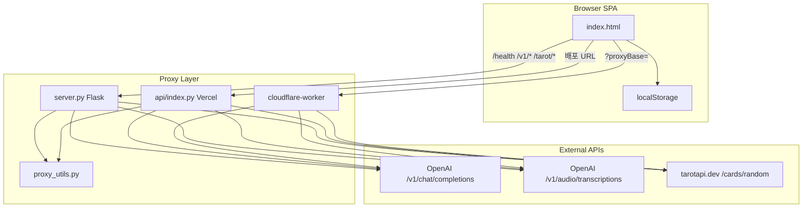

# 🐈‍⬛ 스카이 AI 아바타

**AI41**이 만든 ASD(자폐 스펙트럼) 당사자·보호자 지원용 모바일 웹 솔루션입니다.  
AI 도우미 **스카이**가 대화, 타로, 사회성 연습, 행동 조절, 루틴 관리, 미니게임을 하나의 단일 페이지(`index.html`)에서 제공합니다.

> **문서 목적**  
> 현재 시연을 마친 시점의 기술 상태를 **TRL 6(관련 환경에서의 시스템 시연)** 수준으로 정리한 기술 문서입니다.  
> 개발자 온보딩, 사업 보고, 후속 R&D 계획 수립에 공통으로 사용할 수 있도록 작성했습니다.

---

## 1. 프로젝트 개요

### 1.1 배경
- **제작**: AI41 (AI for One, 당신을 위한 AI) — 예비사회적기업 창업지원사업 선정 팀
- **대상**: ASD당사자네트워크 이용자 및 보호자
- **캐릭터**: 스카이 — 팀 단톡방 별명에서 따온 AI 도우미 이름 (대표 이름과 무관)
- **형태**: 설치 없이 브라우저에서 동작하는 모바일 최적화 SPA

### 1.2 해결하려는 문제
- 일상에서 필요한 **대화·정서·사회성·루틴** 지원 도구가 여러 앱에 분산되어 있음
- API 키 입력, CORS, 모바일 UX 등 기술 장벽이 이용자 앞에 노출됨
- 공개 시연·체험 환경에서는 키 관리와 비용 통제가 필요함

### 1.3 핵심 가치
- **단일 진입점**: 채팅 한 곳에서 모든 도구로 이동
- **자연어 라우팅**: "타로 봐줘", "사회성 연습하자" 같은 말로 화면 전환
- **저자극 설계**: 이모지 본문 제한, 짧은 응답, 실패 페널티 최소화
- **시연 친화**: 서버측 키·일일 제한·토큰 상한으로 공개 체험 가능

---

## 2. TRL 6 기술 성숙도 정리

### 2.1 TRL 정의 (본 프로젝트 적용)

| TRL | 정의 | 본 프로젝트 상태 |
|-----|------|------------------|
| TRL 4 | 구성요소 실험실 검증 | ✅ 초기 프로토타입 완료 |
| TRL 5 | 관련 환경에서 구성요소 검증 | ✅ 개별 모듈(채팅/타로/사회성/프록시) 검증 완료 |
| **TRL 6** | **관련 환경에서 시스템 시연** | **✅ 현재 단계** |
| TRL 7 | 운영 환경에서 시스템 시연 | ⬜ 미진입 |
| TRL 8~9 | 실제 서비스·상용화 | ⬜ 미진입 |

**TRL 6 판정 근거**
- 단일 통합 시스템(프론트 + 프록시 + 외부 AI API)이 **실제 배포 환경**에서 동작함
- 공개 시연용 **DEMO_MODE** 운영 경험을 확보함
- ASD당사자네트워크 맥락의 **실사용 시나리오**(사회성 연습, 행동 조절, 회원가입 안내)가 구현·시연됨
- 모바일 브라우저, HTTPS, 서버리스/PaaS 등 **운영에 가까운 환경**에서 end-to-end 흐름 검증

### 2.2 시연 완료 시점에서 검증된 항목

| 영역 | 검증 내용 | 결과 |
|------|-----------|------|
| 통합 UX | 채팅 → 도구 진입 → 복귀 | ✅ 단일 페이지 내 완결 |
| AI 대화 | GPT 스트리밍 응답 | ✅ 정상 |
| 타로 | 카드 API + AI 해석 + 이미지 표시 | ✅ 정상 (일일 1회 제한 포함) |
| 사회성 연습 | 페르소나 롤플레이 + 피드백 | ✅ 정상 (턴 제한·캐시 포함) |
| 행동 조절 | 로컬 가이드 + LLM 코칭 + 일일 리포트 | ✅ 정상 |
| 루틴 관리 | CRUD + 진행률 코칭 | ✅ 정상 |
| 미니게임 | 9종 저자극 게임 | ✅ 정상 |
| 시연 모드 | 서버 키 인증, 키 UI 숨김, 음성 차단 | ✅ 정상 |
| 배포 | Vercel / Render / Cloudflare Worker | ✅ 다중 경로 지원 |
| 비용 통제 | 토큰 상한, 일일 제한, 요청 정제 | ✅ 적용 |

### 2.3 TRL 6에서 아직 미완인 항목 (TRL 7 진입 전 과제)

| 항목 | 현재 한계 | TRL 7 목표 |
|------|-----------|------------|
| 사용자 계정 | localStorage 기반, 기기 종속 | 계정·동기화·보호자 연동 |
| 데이터 거버넌스 | 클라이언트 저장 위주 | 서버 저장, 동의·보관 정책 |
| 운영 모니터링 | `/health` 수준 | 로그, 알림, 사용량 대시보드 |
| 품질 검증 | 수동 시연 중심 | 자동 테스트, 시나리오 회귀 테스트 |
| 임상/교육 효과 | 정성적 체험 수준 | 파일럿 평가, 피드백 수집 체계 |
| 멀티테넌트 | 단일 배포 인스턴스 | 기관별 설정·키·콘텐츠 분리 |

---

## 3. 시스템 아키텍처

### 3.1 전체 구조



### 3.2 프런트엔드 (`index.html`)
- **구조**: 단일 HTML 파일에 UI·스타일·로직 통합 (~5,700줄)
- **상태 모델**: 오버레이 기반 멀티 모드
  - `home` — 기본 대화
  - `tarot` — 타로 리딩
  - `social` — 사회성 연습 (연령 → 시나리오 → 롤플레이 → 피드백)
  - `picture` — 그림 말하기
  - `regulation` — 행동 조절
  - `routine` — 루틴 관리
  - `games` — 미니게임
  - `about` — AI41/스카이 소개
- **캐릭터**: `character.js` → `character.json` → SVG 폴백 순서
- **모바일 UX**: `max-width: 440px`, safe-area 대응, 하단 입력바 고정

### 3.3 프록시 레이어
공통 책임 (`proxy_utils.py` / Worker JS 동기화):

| 엔드포인트 | 역할 |
|------------|------|
| `GET /health` | 시연 모드·키 준비 상태 반환 |
| `POST /v1/chat/completions` | OpenAI 채팅 스트리밍 프록시 |
| `POST /v1/audio/transcriptions` | 음성 전사 프록시 (시연 모드 403) |
| `GET /tarot/random` | tarotapi.dev CORS 우회 |

**요청 정제 정책**
- `modalities` 필드 제거
- `image_url`, `input_audio`, `audio`, `image` 파트 차단
- `max_tokens` 없으면 256, 최대 600으로 클램프

**인증 정책**
- `DEMO_MODE=1`: 서버 환경변수 키만 사용, 클라이언트 Authorization 무시
- `DEMO_MODE=0`: 클라이언트 Authorization 우선, 없으면 서버 키 fallback

### 3.4 AI 호출 설계

| 기능 | 모델 | 스트리밍 | max_tokens | 비고 |
|------|------|----------|------------|------|
| 일반 대화 | `gpt-5.4-mini` | ✅ | 120 | 1~2문장 응답 유도 |
| 타로 해석 | `gpt-5.4-mini` | ✅ | 320 | 포지션별 1문장 + 종합 1문장 |
| 사회성 롤플레이 | `gpt-5.4-mini` | ✅ | 140 | 페르소나 고정, temperature 0.75 |
| 사회성 피드백 | `gpt-5.4-mini` | ✅ | 400 | 사용자 발화 없으면 생성 차단 |
| 행동/루틴 코칭 | `gpt-5.4-mini` | ❌ | 72 | 실패 시 로컬 fallback |
| 음성 전사 | Whisper 계열 | ❌ | — | WebM→WAV(24kHz) 후 업로드 |

**응답 품질 가드**
- 스트리밍 중복 제거 (`removeConsecutiveRepeat`)
- 429 응답 자동 재시도 (`fetchApiWithRetry`, 최대 2회)
- 시스템 프롬프트로 이모지·이모티콘·URL 직접 출력 금지

---

## 4. 기능 모듈 상세

### 4.1 기본 대화
- 텍스트 입력, 엔터 전송, 대화 초기화
- 음성 입력: `MediaRecorder` → WAV 변환 → STT → 의도 라우팅 또는 채팅
- TTS: `speechSynthesis` (시연 모드 비활성)
- 채팅창 최대 16개 말풍선 유지

### 4.2 자연어 도구 라우팅 (`detectToolIntent`)
사용자 발화(텍스트·음성 전사)를 분석해 해당 화면으로 즉시 이동합니다.

| 의도 키워드 예시 | 이동 대상 |
|------------------|-----------|
| 타로, 점 봐줘, 운세 | 타로 |
| 사회성 연습, 롤플레이 | 사회성 연습 |
| 그림 말하기, 비언어 | 그림 말하기 |
| 멜트다운, 호흡, 그라운딩 | 행동 조절 |
| 루틴, 할 일 | 루틴 관리 |
| 패턴게임, 뽁뽁이, 미니게임 | 미니게임 (세부 게임까지) |
| 회원가입, ASD당사자네트워크 | 회원가입 문의 폼 안내 |

사회성 연습 중에는 `"미취학"`, `"3번"` 같은 내비게이션 명령도 파싱합니다.

### 4.3 타로 리딩
**스프레드**
- 오늘의 카드 (1장)
- 과거·현재·미래 (3장)
- 마음·상황·조언 (3장)
- 켈틱 간소 (5장)

**흐름**
1. tarotapi.dev에서 카드 데이터 수신 (`/tarot/random`)
2. 카드 뒤집기·lightbox 확대
3. `JPG/` 폴더 이미지 로드 (`name_short` 규칙)
4. GPT 스트리밍 해석
5. 당일 결과 `chunjik.tarotDaily`에 저장 → **하루 1회 제한**

### 4.4 사회성 연습
**연령대별 시나리오 (총 12개)**

| 연령 | 시나리오 수 | 예시 |
|------|-------------|------|
| 미취학 (4~6세) | 4 | 인사하기, 차례 지키기, 감정 표현, 놀이 끼어들기 |
| 청소년 (13~17세) | 4 | 점심 대화 합류, 오해 풀기, 놀림 대응, 놀자 제안 |
| 성인 (18~35세) | 4 | 스몰토크, 피드백 수용, 자기 옹호, 데이트 신청 |

**성인 시나리오**는 `personaGuide`로 난이도(1~5), 성격, 화법, 압박 패턴을 정의합니다.

**세션 제어**
- 사용자 턴 최대 8회 (`MAX_SOCIAL_USER_TURNS`)
- API 전송 시 최근 8턴 / 사용자 메모리 4개 / 로그 20줄만 사용
- 피드백은 당일 `chunjik.socialFeedbackDaily`에 캐시
- 사용자 발화(`[나]`) 없으면 피드백 API 호출 차단

### 4.5 그림 말하기
비언어 아동용 핵심 요청 6종 버튼:
- 물, 화장실, 쉬기, 배고픔, 멈춰달라, 도와달라
- 버튼 탭 시 `speechSynthesis`로 즉시 음성 출력

### 4.6 행동 조절
**상태 4종**
- 감각 과민 / 불안 / 분노·폭발 직전 / 다운·무기력

**제공 도구**
- 상태별 로컬 안정 가이드
- 호흡 루틴 (4-4-6)
- 그라운딩 (5-4-3-2-1)
- LLM 2문장 코칭 (실패 시 로컬 문구)
- 일일 사용 로그 집계 리포트 (`localStorage`)

### 4.7 루틴 관리
- 루틴 추가·완료 체크·삭제
- 진행률 기반 LLM 코칭
- 데이터는 `localStorage`에 저장

### 4.8 미니게임 (저자극 9종)

| 게임 | 설계 의도 |
|------|-----------|
| 뽁뽁이 터트리기 | 즉각적 시각·청각 피드백, 실패 없음 |
| 원 그리기 | 정확도 점수, 짧은 세션 |
| Pattern Echo | 패턴 기억·따라하기 |
| Sort & Calm | 정렬 행동의 안정감 |
| Soft Rhythm Tap | 리듬·예측 가능한 반복 |
| Low Stimulus Spot the Difference | 저자극 시각 탐색 |
| Loop Builder | 예측 가능한 반복 애니메이션 |
| Safe Click | 지정 색만 클릭, 안전 행동 연습 |
| Emotion Match | 감정 라벨 매칭 |

공통: 사운드 ON/OFF, 시간 제한·실패 페널티 최소화, 이모지는 아이콘 영역만 사용

---

## 5. 시연 모드 (DEMO_MODE)

공개 시연·체험을 위해 설계된 운영 모드입니다.

### 5.1 동작 방식
1. 앱 로드 시 `GET /health` 호출
2. `demo_mode: true`이면 시연 모드 활성화
3. API 키 입력 UI·마이크 버튼 숨김
4. 모든 AI 요청은 서버측 `OPENAI_API_KEY`로 인증
5. 음성 업로드(`/v1/audio/transcriptions`)는 403 차단

### 5.2 시연 모드에서 가능/불가

| 가능 | 불가 |
|------|------|
| 텍스트 대화 | 음성 입력·STT |
| 타로 (1일 1회) | 개인 API 키 입력 |
| 사회성 연습 | TTS 응답 재생 |
| 행동 조절·루틴·게임 | — |
| 회원가입 안내 | — |

### 5.3 비용·남용 방지
- 기능별 `max_tokens` 상한
- 프록시 레벨 `max_tokens` 600 클램프
- 타로·사회성 피드백 일일 캐시로 중복 API 호출 방지
- 사회성 연습 턴 수 제한

---

## 6. 데이터·보안

### 6.1 저장 위치

| 데이터 | 저장소 | 비고 |
|--------|--------|------|
| API 키 (비시연) | `localStorage` | 브라우저 로컬 |
| 이용자 ID | `localStorage` | `chunjik.userId` (익명 UUID) |
| 동의 상태 (캐시) | `localStorage` | `chunjik.privacyConsentCache` |
| 프록시 URL | `localStorage` | `chunjik.proxyBase` |
| 타로 일일 결과 | `localStorage` | `chunjik.tarotDaily` |
| 사회성 피드백 | `localStorage` | `chunjik.socialFeedbackDaily` |
| 행동 조절 로그 | `localStorage` | 최대 300건 |
| 루틴 목록 | `localStorage` | 기기 종속 |
| **대화·활동 (동의 시)** | **서버 SQLite (`data/privacy.db`)** | **Fernet 암호화** |
| 서버 API 키 | 환경변수 | `.env` / 배포 시크릿 |
| 보호자 PIN | 환경변수 | `GUARDIAN_PIN` |

### 6.2 개인정보·보호자 기능 (구현됨)

**동의 워크플로우**
- 최초 접속 시 동의 모달 (`동의하고 시작` / `동의 안 함`)
- `+` 메뉴 → `개인정보`에서 동의·철회·데이터보내기·삭제 관리
- API: `GET/POST /api/privacy/consent`

**서버 암호화 저장**
- 동의한 이용자의 대화·활동만 저장
- 메시지 본문·활동 상세는 Fernet(AES)으로 암호화
- API: `POST /api/privacy/messages`, `POST /api/privacy/activity`

**GDPR/개인정보보호법 권리**
- **열람·이전**: `GET /api/privacy/export?user_id=...` → JSON 다운로드
- **삭제**: `DELETE /api/privacy/data?user_id=...` → 서버 기록 영구 삭제
- **동의 철회**: `POST /api/privacy/consent` (`accepted: false`)

**보호자 대시보드**
- `+` 메뉴 → `보호자 보기` → PIN 로그인 (`GUARDIAN_PIN`)
- 이용자 목록 조회, 대화·활동 로그 읽기 전용 열람
- API: `POST /api/privacy/guardian/login`, `GET /api/privacy/guardian/users`, `GET /api/privacy/guardian/dashboard`

### 6.3 보안 원칙
- API 키를 소스코드에 하드코딩하지 않음
- `.env`, `data/`는 git 제외
- 시연 모드에서 클라이언트 키·음성 업로드 차단
- 프록시에서 멀티모달(이미지/오디오) 업스트림 전송 차단
- 보호자 세션 토큰 1시간 만료, PIN은 서버 환경변수만 보관

### 6.4 환경 변수 (개인정보)

| 변수 | 설명 | 기본값 |
|------|------|--------|
| `PRIVACY_ENABLED` | 개인정보 API 활성화 | `1` |
| `GUARDIAN_PIN` | 보호자 대시보드 PIN | — (필수 권장) |
| `PRIVACY_ENCRYPTION_KEY` | Fernet 키 (선택) | `GUARDIAN_PIN` 파생 |
| `DATA_DIR` | SQLite 저장 경로 | `./data` |

> **Vercel 서버리스 주의**: SQLite 파일이 인스턴스 간 공유되지 않을 수 있습니다. 영구 저장이 필요하면 Render 등 디스크 있는 런타임을 권장합니다.

### 6.6 블로그 CMS · 외부 API

| 항목 | 설명 |
|------|------|
| DB | Neon Postgres (`DATABASE_URL`) |
| 공개 | `GET /api/blog/posts`, `GET /api/blog/posts/:slug` |
| 관리 | `/admin.html` + `ADMIN_PIN` (HMAC 토큰, `X-Admin-Token`) |
| 홈 UI | `stage-blog` — 페이지당 3개 썸네일+제목, 좌우 페이지네이션 |
| 날씨 | `GET /api/weather` → Open-Meteo (채팅: 「서울 날씨」) |
| 지도 | `GET /api/maps/geocode` → Nominatim/OSM (채팅: 「서울역 지도」) |

| 변수 | 설명 |
|------|------|
| `DATABASE_URL` | Neon 연결 문자열 |
| `ADMIN_PIN` | 블로그 관리자 PIN |
| `ADMIN_TOKEN_SECRET` | 토큰 서명용 (선택) |
| `WEATHER_DEFAULT_Q` | 「날씨」만 말할 때 기본 도시 (기본: 서울) |

### 6.5 TRL 7 진입 전 남은 과제
- 보호자·이용자 계정 체계 (현재는 익명 user_id + PIN)
- 서버 감사 로그·운영 모니터링
- 법적 고지문·개인정보처리방침 페이지 외부화
- 다중 기기 동기화 및 보호자-이용자 연결(페어링)

---

## 7. 배포·운영

### 7.1 지원 배포 경로

| 플랫폼 | 구성 | 적합 용도 |
|--------|------|-----------|
| **Render** (`render.yaml`) | Flask + gunicorn | 상시 운영, 시연 서버 |
| **Vercel** (`vercel.json`) | 정적 + `api/index.py` | 빠른 배포, 서버리스 |
| **Cloudflare Worker** | 프록시 전용 | 정적 Pages + API 분리 |
| **로컬** (`server.py`) | 개발·검증 | TRL 검증, 디버깅 |

### 7.2 환경 변수

| 변수 | 설명 | 기본값 |
|------|------|--------|
| `OPENAI_API_KEY` | OpenAI API 키 (우선) | — |
| `KANANA_SERVER_API_KEY` | Python/Vercel 대체 키 이름 | — |
| `KANANA_API_KEY` | Cloudflare Worker 대체 키 이름 | — |
| `DEMO_MODE` | `1`=시연, `0`=개인 키 모드 | `1` |
| `PORT` | 로컬 서버 포트 | `8080` |
| `PRIVACY_ENABLED` | 개인정보 API 활성화 | `1` |
| `GUARDIAN_PIN` | 보호자 대시보드 PIN | — |
| `PRIVACY_ENCRYPTION_KEY` | Fernet 암호화 키 (선택) | PIN 파생 |
| `DATA_DIR` | SQLite 경로 | `./data` |
| `DATABASE_URL` | Neon Postgres (블로그) | — |
| `ADMIN_PIN` | 블로그 관리자 PIN | — |
| `WEATHER_DEFAULT_Q` | 기본 날씨 도시 | `서울` |
| `CONTACT_TO` / `RESEND_API_KEY` | 문의 메일 | — |
| `DATA_DIR` | SQLite 저장 경로 | `./data` |

### 7.3 배포 후 확인 체크리스트
- [ ] `GET /health` → `demo_mode`, `ready` 확인
- [ ] 텍스트 대화 스트리밍 정상
- [ ] 타로 카드 뽑기 + 해석 정상
- [ ] 사회성 연습 롤플레이 + 피드백 정상
- [ ] 시연 모드에서 API 키 UI·마이크 숨김 확인
- [ ] `JPG/` 카드 이미지 로드 확인
- [ ] 하드코딩 API 키 없음 확인

---

## 8. 빠른 시작 (개발자)

```bash
pip install -r requirements.txt
cp .env.example .env   # OPENAI_API_KEY 입력
python server.py
```

브라우저: `http://localhost:8080`

- `DEMO_MODE=1` (기본): 시연 모드, 서버 키만 사용
- `DEMO_MODE=0`: 브라우저에서 `sk-...` 키 입력 후 음성 입력 가능

`file://`로 `index.html`을 직접 열면 API 경로를 사용할 수 없으므로 로컬 서버 실행을 권장합니다.

### 프록시 URL (Cloudflare Worker 등)
```
https://<your-domain>/?proxyBase=https://<worker-domain>
```
한 번 지정하면 `localStorage`에 저장되어 유지됩니다.

---

## 9. 파일 구조

```
chunjik/
├── index.html              # SPA UI
├── admin.html              # 블로그 관리자 (PIN)
├── character.js            # Lottie 애니메이션 데이터 (선택)
├── server.py               # 로컬 Flask 프록시 + 정적 서빙
├── proxy_utils.py          # 프록시 공통 로직
├── privacy_store.py        # 암호화 저장소 (SQLite)
├── privacy_routes.py       # 개인정보·보호자 API
├── blog_store.py           # Neon 블로그 스토어
├── blog_routes.py          # 블로그 공개·관리 API
├── contact_mail.py / contact_routes.py
├── external_routes.py      # 날씨·지도 프록시
├── api/index.py            # Vercel 서버리스 엔트리
├── js/blog.js / js/admin.js
├── requirements.txt        # Python 의존성
├── .env.example            # 환경 변수 템플릿
├── Procfile                # PaaS 시작 명령
├── render.yaml             # Render 배포 설정
├── vercel.json             # Vercel 라우팅
├── cloudflare-worker/      # Worker 프록시
│   ├── src/worker.js
│   └── wrangler.toml
└── JPG/                    # 타로 카드 이미지 (name_short 규칙)
```

---

## 10. 기술 스택

| 계층 | 기술 |
|------|------|
| 프런트 | Vanilla JS, HTML/CSS, lottie-web (CDN) |
| 음성 | MediaRecorder API, Web Audio API, SpeechSynthesis |
| AI | OpenAI Chat Completions (SSE), Audio Transcriptions |
| 백엔드 | Flask, flask-cors, requests, gunicorn |
| 프록시 | Cloudflare Workers, Vercel Python Runtime |
| 외부 | tarotapi.dev (타로 카드 데이터) |

---

## 11. TRL 7+ 로드맵

### Phase 1 — 운영 환경 시연 (TRL 7)
- 사용자 계정·세션 서버 저장
- 보호자/상담자 읽기 전용 뷰
- 운영 로그·에러 모니터링
- 자동 E2E 테스트 (의도 라우팅, 타로, 사회성 피드백)

### Phase 2 — 파일럿 서비스 (TRL 8 준비)
- ASD당사자네트워크 파일럿 배포
- 사용 데이터 기반 시나리오 개선
- 접근성·인지 부하 추가 검증
- 개인정보 처리방침·동의 흐름 정비

### Phase 3 — 상용화 준비 (TRL 9)
- 기관별 멀티테넌트
- 요금·쿼터·SLA
- 임상/교육 효과 평가 연계
- 콘텐츠 CMS 및 시나리오 외부화

---

## 12. 트러블슈팅

| 증상 | 확인 사항 |
|------|-----------|
| API 503 | `OPENAI_API_KEY` 환경변수 설정·재배포 |
| CORS 오류 | `server.py` 또는 배포 URL로 접속 |
| 음성 인식 안 됨 | `DEMO_MODE=0`, 마이크 권한, HTTPS/localhost |
| 타로 이미지 없음 | `JPG/` 파일명이 tarotapi `name_short`와 일치하는지 확인 |
| 타로 재뽑기 불가 | 일일 1회 제한 — 다음 날 또는 `chunjik.tarotDaily` 삭제 |
| 시연 모드인데 응답 없음 | `/health`의 `ready: false` — 서버 키 미설정 |

---

## 13. 라이선스·고지

- 본 앱의 사회성 시나리오·피드백은 AI가 생성하는 **앱 전용 콘텐츠**이며, 특정 기관·상표 교육 프로그램을 대표하지 않습니다.
- 타로 카드 데이터: [tarotapi.dev](https://tarotapi.dev)
- 회원가입 문의: [ASD당사자네트워크 폼](https://form.naver.com/response/jfjr-1UnoCULGFekjKnjow)

---

*최종 업데이트: 2026년 7월 — 시연 완료, TRL 6 정리 기준*
